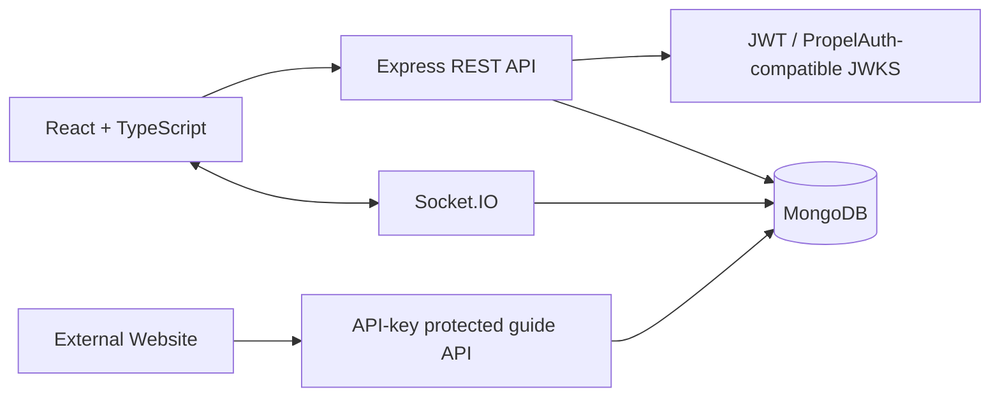

# Wandermate

A portfolio-ready full-stack platform that connects travelers with local tour guides. It demonstrates **real-time chat with Socket.IO, secure authentication integration, MongoDB persistence, Mapbox-powered guide discovery, and reusable public API services**.

## Features

- Browse and filter local tour guides
- Interactive map when a Mapbox token is configured
- Start traveler–guide conversations
- Real-time messaging over Socket.IO
- MongoDB persistence with Mongoose
- Production authentication path using PropelAuth-compatible JWT/JWKS settings
- Local development authentication without an external account
- Public guide API protected by an API key for third-party integrations
- Seed script, validation, health checks, error handling, and Docker Compose

## Architecture



## Quick start with Docker

```bash
cp backend/.env.example backend/.env
cp frontend/.env.example frontend/.env
docker compose up --build
```

Open `http://localhost:5174`.

The local development UI sends an `x-user-id` header so the app works immediately. Set `AUTH_MODE=propelauth` for production token verification.

## Manual setup

### Backend

```bash
cd backend
cp .env.example .env
npm install
npm run seed
npm run dev
```

### Frontend

```bash
cd frontend
cp .env.example .env
npm install
npm run dev
```

## PropelAuth-compatible production mode

Set the following backend variables:

```env
AUTH_MODE=propelauth
PROPELAUTH_AUTH_URL=https://YOUR_AUTH_URL
PROPELAUTH_AUDIENCE=YOUR_API_AUDIENCE
```

The API validates bearer tokens using the issuer's JWKS endpoint. Configure the frontend to obtain a token from your PropelAuth client and replace the development `x-user-id` header with `Authorization: Bearer <token>`.

## Mapbox

Set this frontend variable to enable the interactive map:

```env
VITE_MAPBOX_TOKEN=your_public_mapbox_token
```

Without a token, the app displays a graceful map placeholder and remains fully usable.

## Public API integration

Partner websites can access guide listings with an API key:

```bash
curl http://localhost:4000/public/v1/guides \
  -H 'x-api-key: wandermate-demo-key'
```

Change `PUBLIC_API_KEY` before deploying.

## Tests

```bash
cd backend
npm test
```

## Resume-ready description

> Developed a full-stack platform connecting travelers with local tour guides, integrating Socket.IO for real-time chat, PropelAuth-compatible authentication, Mapbox for interactive discovery, MongoDB persistence, and reusable APIs for external website integrations.
